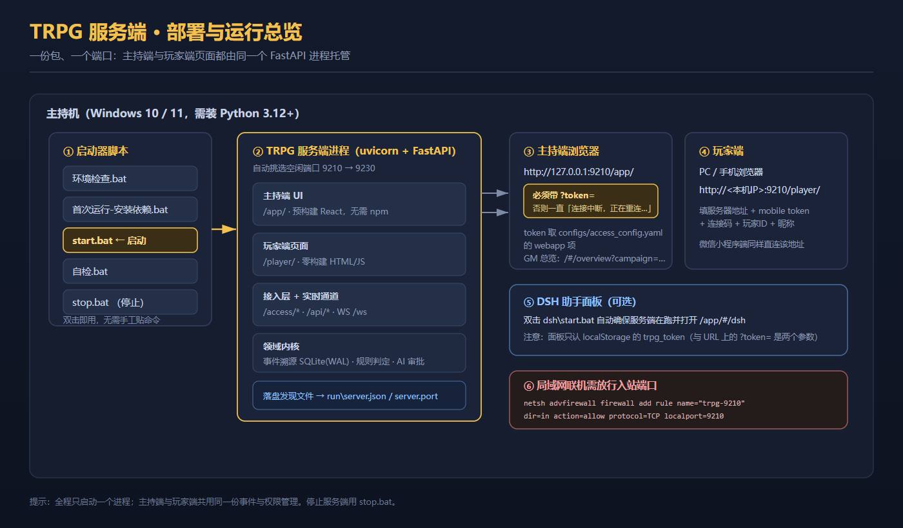

# TRPG 跑团辅助系统

[](LICENSE)
[](https://github.com/ddtdas/trpg-delivery-trio/releases/latest)
[](docs/服务端-使用与配置手册.md)
[](docs/服务端-使用与配置手册.md)
[](docs/服务端-使用与配置手册.md)
[](#快速开始)

> **TRPG（桌上角色扮演游戏）跑团辅助系统** —— 真人主持 + AI 辅助的局域网跑团解决方案：
> 主持人一键开桌，玩家 PC / 手机浏览器 / 微信小程序三端同时入局。
> 事件溯源驱动回合、实时事件流广播、AI 副主持人建议、语音转写与 NPC 自主叙事一应俱全。

本仓库是**源码仓库**：三个交付组件的最新源码 + 完整使用文档。
需要打包好的交付 zip（含离线依赖 wheels）请到 **[Releases](https://github.com/ddtdas/trpg-delivery-trio/releases/latest)** 下载。

---

## 三件套组成

| 组件 | 目录 | 技术栈 | 职责 |
|---|---|---|---|
| **TRPG-服务端** | [`TRPG-服务端/`](TRPG-服务端/) | Python 3.12+ / FastAPI / SQLite(WAL) / WebSocket | 唯一业务核心：事件溯源、规则判定、回合调度、三端鉴权、AI 建议、STT/TTS、MCP 工具、静态托管 |
| **TRPG-Web客户端** | [`TRPG-Web客户端/`](TRPG-Web客户端/) | 纯 HTML/CSS/JS（零构建、零 CDN）+ Python 标准库反代 | PC / 移动浏览器玩家端：连接设置、连接码解析、行动提交、事件流、语音录制上传 |
| **TRPG-微信小程序客户端** | [`TRPG-微信小程序客户端/`](TRPG-微信小程序客户端/) | 微信小程序原生（无 npm 依赖） | 微信玩家端：与 Web 客户端功能集合完全一致（F1–F10），直连服务端 |

设计铁律：**服务端是唯一业务核心，两个客户端零业务逻辑**，只负责「采集输入 → 调服务端 → 渲染事件流」；
两端玩家功能集合（F1–F10）、文案表（`strings.json`）、设计令牌**逐字节一致**，可见差异仅限容器宽度与导航形态。

---

## 架构总览



- **单一写路径**：一切状态变化以「事件」为唯一事实源（Event Sourcing），写事件必须经 `CommandBus` → `EventStore.append`，可重放、可恢复、可审计。
- **双通道事件流**：REST 轮询为**主通道**（完整性权威），WebSocket 为可选增强（连不上静默降级，绝不影响文案与状态行）。
- **实时性**：`EventStore.on_append` 为唯一发布收口，一事件一帧扇出到房间成员，服务端每 15s 心跳。
- **端鉴权隔离**：`mobile` / `webapp` / `recorder` 三端 token，端点级权限矩阵（401 / 403 `kp_only` / `mobile_only`）。

---

## 核心特性

- 🎲 **事件溯源内核**：37 种事件类型（冻结契约）、全局单调递增 seq、SQLite WAL + 快照恢复、确定性投影。
- 🔄 **回合状态机**：IDLE → COLLECTING → CLOSED → RESOLVING → ADVANCED，`req_id` 幂等 + 分支守卫（并发提交不丢事件）。
- 👁 **可见性隔离**：whisper 私语 / 条件情报 / 暗骰（KP-only）服务端权威过滤，客户端声明不可信。
- 🤖 **AI 副主持人**：LLM 多端点网关（密钥仅环境变量）、AgentSlot 单提案槽、KP 审稿链（approve / edit / reject）、NPC 技能 / 记忆 / 自主行动与提案。
- 🗣 **语音链路**：玩家录音上传 → STT 转写（云端 / mock 降级）→ 事件流；TTS 三级降级链。
- 🧩 **场景交互与审批总线**：可交互物热区（anchor 坐标 + 动作集）、敏感动作统一进待审队列，拍板前玩家侧看不到任何候选正文（防泄漏）。
- 🛠 **MCP 工具面**：`tools/list` + `tools/call` + 13×3 工具权限矩阵。
- 📦 **规则包**：d100 骰子 / 检定三档 / 战斗 / 成长；CoC 7e、D&D 5e 等规则包可热插拔。
- 🔌 **三端一致**：两端玩家端 F1–F10 功能与文案、令牌（设计令牌）逐字节一致。

---

## 快速开始

> 📖 完整使用手册见 [`docs/服务端-使用与配置手册.md`](docs/服务端-使用与配置手册.md)（安装 / 启动 / 配置 / 联机 / 排错）。

### 方式 A：直接下载交付包（推荐，含离线依赖）

到 **[Releases 最新版](https://github.com/ddtdas/trpg-delivery-trio/releases/latest)** 下载
`TRPG-server.zip` / `TRPG-web-client.zip` / `TRPG-wechat-miniprogram.zip` 三个交付包，
解压到同一父目录即可按手册运行。

### 方式 B：clone 源码仓库

```bash
git clone https://github.com/ddtdas/trpg-delivery-trio.git
cd trpg-delivery-trio/TRPG-服务端
```

### 1. 服务端（主持端）

```bat
cd TRPG-服务端
环境检查.bat            :: 可选但推荐：检查 Python / 依赖 / 端口
首次运行-安装依赖.bat     :: 有网走 pip；无网需自行准备依赖（wheels 见 Release 交付包）
start.bat               :: 自动挑选 9210-9230 空闲端口，轮询 /api/health 确认
```

启动后打开主持端（**必须带 `?token=`**）：

```text
http://127.0.0.1:<端口>/app/?token=<webapp token>
```

`token` 取 `TRPG-服务端\configs\access_config.yaml` 的 `webapp` 项。

### 2. 玩家端

```text
http://<本机IP>:<端口>/player/    :: PC / 手机浏览器
```

页面填写：服务器地址 + **mobile token** + 连接码 + 玩家 ID + 昵称 → 「测试连接」→「解析连接码」→「加入跑团」。

### 3. 微信小程序端

微信开发者工具「导入项目」选择 `TRPG-微信小程序客户端\` 本身（appid=`touristappid`，无需真实 AppID）；
在「详情 → 本地设置」勾选「不校验合法域名、TLS 版本以及 HTTPS 证书」，即可直连 `http://<服务端IP>:9210`。

### 4. 停止

```bat
cd TRPG-服务端
stop.bat
```

---

## 仓库结构

```text
trpg-delivery-trio/
├─ TRPG-服务端/               服务端源码（FastAPI 应用 + 领域内核 + 主持端/玩家端页面）
│  ├─ app/                   服务端应用（web/ domain/ store/ scheduler/ agent/ voice/ mcp/ rules/ npc/）
│  ├─ configs/               配置文件（三端 token / AI 通道 / 桌默认值）
│  ├─ web/dist/              主持端界面（预构建，无需 npm）
│  ├─ player-web/            玩家端页面（零构建）
│  ├─ scripts/  modules/  rulepacks/  skills/  dsh/  modpacks/
│  ├─ start.bat / stop.bat   启动 / 停止
│  └─ 环境检查.bat / 首次运行-安装依赖.bat / 自检.bat
├─ TRPG-Web客户端/            Web 玩家端源码（client/ 零构建页面 + scripts/ 同源反代）
├─ TRPG-微信小程序客户端/      微信小程序源码（pages/ + lib/，无 npm 依赖）
├─ docs/
│  ├─ 服务端-使用与配置手册.md   ★ 使用手册：安装 / 启动 / 配置 / 联机 / 排错
│  ├─ TRPG-项目架构与调度关系说明.md
│  ├─ 验收结论与封装说明.md
│  └─ images/                配图（SVG 矢量 + PNG 位图 + 社交预览图）
├─ README.md                 本文件
└─ LICENSE                   MIT License
```

> 各组件目录内有自己的 `.gitignore`：运行期数据（`run/`、`data/*`、`campaigns/`、`*.db`、日志）、
> Python 缓存（`__pycache__/`、`.pytest_cache/`）、备份文件（`*.bak-*`）与密钥文件不入库。
> `TRPG-服务端/wheels/`（离线依赖）也在 git 忽略之列 —— 需要离线交付请使用 Release 打包版。

---

## 文档

| 文档 | 内容 |
|---|---|
| [`docs/服务端-使用与配置手册.md`](docs/服务端-使用与配置手册.md) | **服务端完整使用手册**：环境要求、三步启动、依赖安装、启动停止与退出码、三端打开方式、配置方法、局域网联机、可选增强功能、九大类常见问题处理 |
| [`docs/TRPG-项目架构与调度关系说明.md`](docs/TRPG-项目架构与调度关系说明.md) | 三件套总体架构、服务端内部模块、调度关系（回合状态机 / 事件流 / 幂等表）、F1–F10 功能映射、端点矩阵 |
| [`docs/验收结论与封装说明.md`](docs/验收结论与封装说明.md) | 封装流程、交付物清单、启动步骤、已知限制与分发须知 |

---

## 安全提示

- 仓库内 `TRPG-服务端\configs\access_config.yaml` 三端 token 为**明文默认值**，对外分发前**必须更换**
  （`python -c "import secrets;print(secrets.token_hex(16))"` 生成新值）。
- `/api/*` 部分端点当前不做鉴权，公网暴露必须经反向代理 + 路径白名单 + 认证收口（见服务端包内 `docs/DEPLOY.md`）。
- 密钥（LLM / STT API Key）一律走环境变量，不要提交到仓库。

---

## 许可

本项目基于 [MIT License](LICENSE) 发布。
