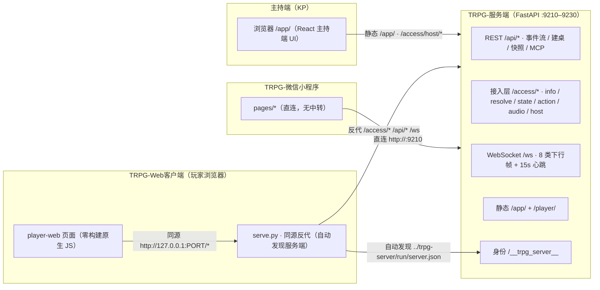

# TRPG 跑团辅助系统 · 交付三件套

[](LICENSE)
[](docs/TRPG-项目架构与调度关系说明.md)
[](docs/TRPG-项目架构与调度关系说明.md)
[](docs/TRPG-项目架构与调度关系说明.md)
[](#快速开始)

> **TRPG（桌上角色扮演游戏）跑团辅助系统** —— 黑客松交付三件套：`服务端` + `Web 客户端` + `微信小程序客户端`。
> 一套开箱即用的局域网跑团解决方案：主持人一键开桌，玩家 PC / 手机浏览器 / 微信小程序三端同时入局，
> 事件溯源驱动回合、实时事件流广播、AI 副主持人建议、语音转写与 NPC 自主叙事一应俱全。

本仓库为**交付包**形态：直接存放三个交付压缩包（含 SHA-256 校验文件）与配套文档，解压即可运行。

> 📖 **新手请直接看** [`docs/服务端-使用与配置手册.md`](docs/服务端-使用与配置手册.md) ——
> 详细讲了三件套中**服务端**的安装、启动、打开、配置、局域网联机与全部常见问题的处理办法。

---

## 三件套组成

| 组件 | 压缩包 | 技术栈 | 职责 |
|---|---|---|---|
| **TRPG-服务端** | `TRPG-服务端.zip` | Python 3.12+ / FastAPI / SQLite(WAL) / WebSocket | 唯一业务核心：事件溯源、规则判定、回合调度、三端鉴权、AI 建议、STT/TTS、MCP 工具、静态托管 |
| **TRPG-Web客户端** | `TRPG-Web客户端.zip` | 纯 HTML/CSS/JS（零构建、零 CDN）+ Python 标准库反代 | PC / 移动浏览器玩家端：连接设置、连接码解析、行动提交、事件流、语音录制上传 |
| **TRPG-微信小程序客户端** | `TRPG-微信小程序客户端.zip` | 微信小程序原生（无 npm 依赖） | 微信玩家端：与 Web 客户端功能集合完全一致（F1–F10），直连服务端 |

设计铁律：**服务端是唯一业务核心，两个客户端零业务逻辑**，只负责「采集输入 → 调服务端 → 渲染事件流」；
两端玩家功能集合（F1–F10）、文案表（`strings.json`）、设计令牌**逐字节一致**，可见差异仅限容器宽度与导航形态。

---

## 架构总览




- **单一写路径**：一切状态变化以「事件」为唯一事实源（Event Sourcing），写事件必须经 `CommandBus` → `EventStore.append`，可重放、可恢复、可审计。
- **双通道事件流**：REST 轮询为**主通道**（完整性权威），WebSocket 为可选增强（连不上静默降级，绝不影响文案与状态行）。
- **实时性**：`EventStore.on_append` 为唯一发布收口，一事件一帧扇出到房间成员，服务端每 15s 心跳。
- **端鉴权隔离**：`mobile` / `webapp` / `recorder` 三端 token，端点级权限矩阵（401 / 403 `kp_only` / `mobile_only`）。

---

## 核心特性

- 🎲 **事件溯源内核**：37 种事件类型（冻结契约）、全局单调递增 seq、SQLite WAL + 快照恢复、确定性投影。
- 🔄 **回合状态机**：IDLE → COLLECTING → CLOSED → RESOLVING → ADVANCED，`req_id` 幂等 + 分支守卫（并发提交不丢事件，实测 8 并发 8/8 成功）。
- 👁 **可见性隔离**：whisper 私语 / 条件情报 / 暗骰（KP-only）服务端权威过滤，客户端声明不可信。
- 🤖 **AI 副主持人**：LLM 多端点网关（密钥仅环境变量）、AgentSlot 单提案槽、KP 审稿链（approve / edit / reject）、NPC 技能 / 记忆 / 自主行动与提案（R28–R31）。
- 🗣 **语音链路**：玩家录音上传 → STT 转写（云端 / mock 降级）→ 事件流；TTS 三级降级链。
- 🧩 **场景交互与审批总线**：可交互物热区（anchor 坐标 + 动作集）、敏感动作统一进待审队列，拍板前玩家侧看不到任何候选正文（防泄漏）。
- 🛠 **MCP 工具面**：`tools/list` + `tools/call` + 13×3 工具权限矩阵。
- 📦 **规则包**：d100 骰子 / 检定三档 / 战斗 / 成长；CoC 7e、D&D 5e 等规则包可热插拔。
- 🔌 **三端一致**：两端玩家端 F1–F10 功能与文案、令牌（设计令牌）逐字节一致。

---

## 快速开始

### 1. 解压与校验

将三个压缩包解压到**同一父目录**（zip 内顶层即各自项目根）：

```text
D:\trpg\TRPG-服务端\
D:\trpg\TRPG-Web客户端\
D:\trpg\TRPG-微信小程序客户端\
```

先校验完整性（与同目录 `*.sha256` 逐位比对）：

```powershell
Get-FileHash .\TRPG-服务端.zip -Algorithm SHA256
Get-FileHash .\TRPG-Web客户端.zip -Algorithm SHA256
Get-FileHash .\TRPG-微信小程序客户端.zip -Algorithm SHA256
```

### 2. 启动服务端（主持端）

```bat
cd D:\trpg\TRPG-服务端
:: 首次运行安装依赖（或使用 wheels/ 离线 wheel）
python -m pip install -r requirements.txt
start.bat        :: 自动选择 9210-9230 空闲端口，轮询 /api/health 确认
```

启动后访问 `http://127.0.0.1:<端口>/api/health`（期望 200），并用 `POST /access/host/table` 开桌、`POST /access/host/turn` 开行动回合。

### 3. 启动 Web 客户端（PC / 浏览器）

```bat
cd D:\trpg\TRPG-Web客户端
start.bat        :: 自动发现同父目录服务端 run/server.json 并打开浏览器
```

页面填写：服务器地址 + **mobile token** + 连接码 + 玩家 ID + 昵称 → 「测试连接」→「解析连接码」→「加入跑团」。

### 4. 导入微信小程序客户端（移动端）

微信开发者工具 →「导入项目」选择 `TRPG-微信小程序客户端\` 本身（appid=`touristappid`，无需真实 AppID）；
在「详情 → 本地设置」勾选「不校验合法域名、TLS 版本以及 HTTPS 证书」，即可直连 `http://<服务端IP>:9210`。

> 三端 token 见 `TRPG-服务端\configs\access_config.yaml`（`mobile` / `webapp` / `recorder`）。
> 🔒 **公开分发前请更换默认 token**（交付验收文档 §1 条件 1）。

---

## 交付物清单与校验值

| 交付物 | 大小 (B) | SHA-256 |
|---|---|---|
| `TRPG-服务端.zip` | 12,501,960 | `9e93f469270f971627a731734032a5af4820a247a3bc0393b7e9e40e226a8074` |
| `TRPG-Web客户端.zip` | 82,877 | `e96d02ff71ef3f6d07a5c36e77f28617458f4d51aff26981d0388997059021a2` |
| `TRPG-微信小程序客户端.zip` | 63,891 | `9d8deae8f6dfa2c454faddbe420297a2f7d08ffc69d84043b79dd11a1e287b74` |

每个压缩包均附 `*.zip.sha256` 侧车文件，二者自洽；上传后已逐文件比对远端 blob 与本地字节，全部一致。

---

## 目录结构

```text
trpg-delivery-trio/
├─ TRPG-服务端.zip                服务端交付包（主持端 + 玩家端页面 + 领域内核）
├─ TRPG-Web客户端.zip             Web 玩家端交付包（零构建 + 同源反代）
├─ TRPG-微信小程序客户端.zip       微信小程序玩家端交付包
├─ *.zip.sha256                   各压缩包 SHA-256 校验侧车
├─ README.md                      本文件
├─ LICENSE                        MIT License
└─ docs/
   ├─ 服务端-使用与配置手册.md        ★ 服务端使用手册：安装 / 启动 / 配置 / 联机 / 排错
   ├─ TRPG-项目架构与调度关系说明.md  架构、模块职责、调度关系、端点矩阵
   ├─ 验收结论与封装说明.md          封装与交付说明、已知限制
   ├─ TRPG-Web客户端.改动.diff       Web 客户端变更说明
   └─ images/                       配图（SVG 矢量 + PNG 位图）
      ├─ 01-architecture.*          部署与运行总览
      ├─ 02-workflow.*              一场跑团的完整流程
      ├─ 03-configuration.*         配置速查
      └─ 04-troubleshooting.*       故障排查决策图
```

---

## 文档

| 文档 | 内容 |
|---|---|
| [`docs/服务端-使用与配置手册.md`](docs/服务端-使用与配置手册.md) | **服务端完整使用手册**：环境要求、三步启动、依赖安装（含离线）、启动停止与退出码、主持端/玩家端/小程序打开方式、三个配置文件怎么改、环境变量怎么设、局域网联机、可选增强功能、**九大类常见问题处理**、目录结构、端点速览 |
| [`docs/TRPG-项目架构与调度关系说明.md`](docs/TRPG-项目架构与调度关系说明.md) | 三件套总体架构、服务端内部模块、调度关系（回合状态机 / 事件流 / 幂等表）、F1–F10 功能映射、端点矩阵 |
| [`docs/验收结论与封装说明.md`](docs/验收结论与封装说明.md) | 封装流程、交付物清单、启动步骤、已知限制与分发须知 |

---

## 安全提示

- 交付包内 `configs/access_config.yaml` 三端 token 为**明文默认值**，正式对外分发前**必须更换**。
- `/api/*` 部分端点当前不做鉴权，公网暴露必须经反向代理 + 路径白名单 + 认证收口（见服务端包内 `docs/DEPLOY.md`）。
- 局域网敏感路径匿名可达属已知基线残余，生产部署请用反代收口。

---

## 许可

本项目基于 [MIT License](LICENSE) 发布。
