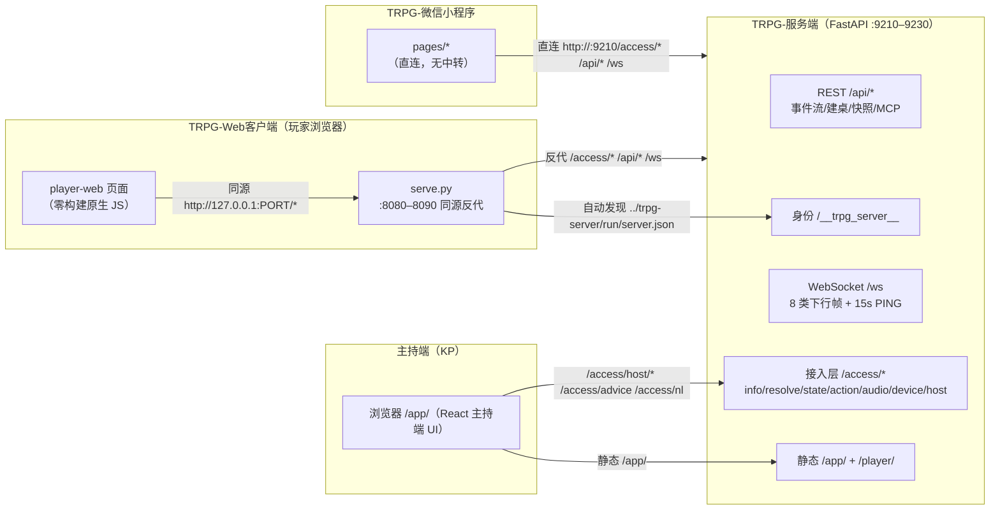
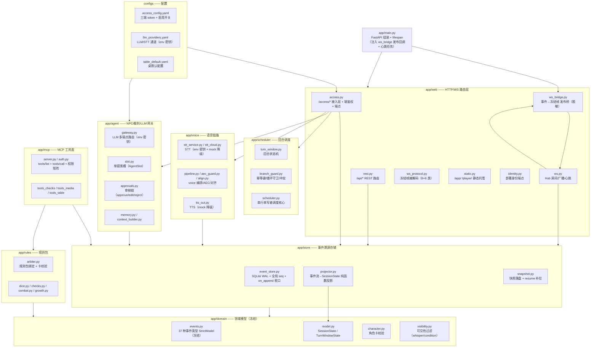
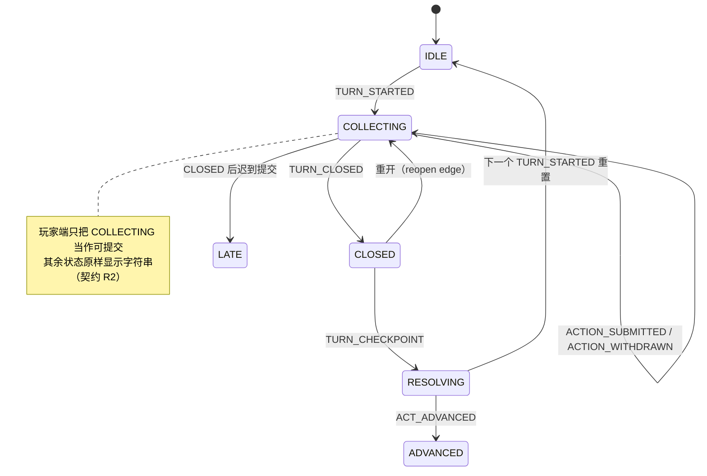
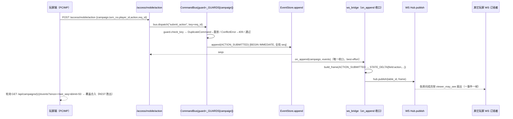
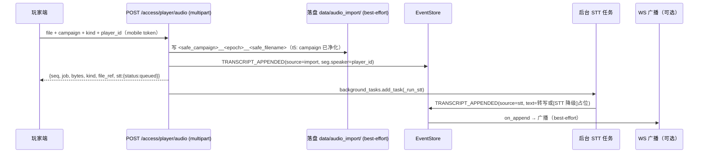

# TRPG 项目架构与调度关系说明

> **文档版本**：v1.0（交付文档）
> **适用版本**：TRPG 交付包-三件套（TRPG-服务端 + TRPG-Web客户端 + TRPG-微信小程序客户端），修复后（t5 完成后）最终源码
> **读者**：评委 / 开发者 / 合作伙伴
> **一致性声明**：本文档逐节与 `E:\dsh3080工作区存放位置\dsh_gzq1\_t9_docs\src_latest\`（远程 192.168.10.110 `C:\Users\Administrator\Desktop\黑客松开发文档\TRPG-交付包-三件套` 同步的最新源码）核对；文中所有文件名/行号/模块职责/端点路径均以修复后源码为准。

---

## 目录

1. [一、三件套总体架构](#一三件套总体架构)
2. [二、服务端内部模块架构](#二服务端内部模块架构)
3. [三、调度关系（重点）](#三调度关系重点)
4. [四、三端功能实现映射（F1–F10）](#四三端功能实现映射f1f10)
5. [五、部署与运维](#五部署与运维)
6. [六、已知边界与风险](#六已知边界与风险)
7. [附录 A：关键文件索引](#附录-a关键文件索引)
8. [附录 B：服务端端点矩阵](#附录-b服务端端点矩阵)

---

## 一、三件套总体架构

TRPG 跑团辅助系统由三件套组成，职责边界清晰：**服务端是唯一业务核心**（规则判定、事件溯源、鉴权、广播），两个客户端**零业务逻辑**，只负责"采集输入→调服务端→渲染事件流"。

### 1.1 职责边界

| 组件 | 角色 | 技术栈 | 业务职责 | 依赖 |
|---|---|---|---|---|
| **TRPG-服务端** | 主持端（KP）后台 | Python 3.12+ / FastAPI / SQLite(WAL) / WebSocket | 事件溯源、规则判定、回合调度、鉴权（三端 token）、LLM 建议、STT/TTS、MCP 工具、静态托管 | 无外部服务（LLM/STT 为可选降级） |
| **TRPG-Web客户端** | PC / 移动浏览器玩家端 | 纯 HTML/CSS/JS（零构建、零 CDN）+ Python 同源反代 | 连接设置、连接码解析、回合状态、行动提交、事件流、语音录制上传、设备状态查询 | 需要一个本地静态服务器（serve.py）解决跨源 |
| **TRPG-微信小程序** | 微信玩家端 | 微信小程序原生（无 npm 依赖） | 与 Web 客户端相同的 F1–F10 功能集合 | 直连服务端，无中转 |

> 设计铁律（源自 docs/CROSS-END-CONTRACT.md）：两个玩家端**功能集合完全一致**（F1–F10 都有、F11/F12 都没有）、**文案逐字一致**（strings.json，三端逐字节一致）、**设计令牌逐值一致**（tokens.json / tokens.wxss）、**可见差异仅限**容器宽度自适应与导航形态。

### 1.2 通信拓扑



**拓扑要点：**

1. **三端与服务端的连线方式不同**：
   - **主持端**：浏览器直接访问服务端 `/app/`（静态 React bundle），通过 `/access/host/*` 做写操作。
   - **Web 玩家端**：浏览器打开的是**本机静态服务器**（serve.py），页面请求一律**同源** `http://127.0.0.1:<port>/...`，由 serve.py 把 `/access/*`、`/api/*`、`/ws` 反向代理到真实服务端——一举解决浏览器同源策略对 fetch 与 WebSocket 的双重拦截，且**零改动服务端冻结面**。这是「零构建 + 反代」方案的核心。
   - **小程序**：微信 API（`wx.request` / `wx.uploadFile` / `wx.connectSocket`）**直连**服务端 9210，不经过任何中转进程（无 9321 中转层，AC-2 判据）。
2. **同一套 /access 契约**：两端玩家使用完全相同的端点、鉴权方式（`Authorization: Bearer <mobile token>` 或 `?token=`）、响应包裹（`{ok,data,code}`）。
3. **自动发现（server.json）**：Web 客户端 `start.ps1` 未显式传 `-ServerUrl` 时，读取同级 `<SiblingRoot>/trpg-server/run/server.json` 的 `port`/`url` 自动对接；小程序因无本地文件系统，由用户在「连接设置」页手填地址（契约 F1）。

### 1.3 端点命名空间划分（三套体系，勿混用）

| 命名空间 | 层 | 响应包裹 | 鉴权 | 用途 |
|---|---|---|---|---|
| `/access/*` | 接入层 | `{ok:true,data,code:0}` 成功；`{ok:false,error,code:<http>}` 失败 | 三端 token 端隔离（401/403 kp_only|recorder_only|mobile_only） | 玩家端 + KP 写操作：info/resolve/state/action/audio/device/host/* |
| `/api/*` | REST | 直接返回对象；失败 `{"detail":...}` + 4xx/422 | **当前不校验**（R1 已知风险，客户端带 `?token=` 前向兼容） | 事件流（F7 主通道）、建桌、快照、MCP 复用等 |
| `/ws` | 实时通道 | WS 帧（kind/json） | 任一启用端 token（握手前校验，失败以 close code 4400 关闭） | 8 类下行帧 + 15s PING（可选增强，轮询恒为主通道） |
| `/app/`、`/player/` | 静态层 | 静态文件 / `{error:...}` 404 | 无（页面本身不含密钥） | 主持端 UI、玩家端页面托管 |
| `/__trpg_server__` | 身份层 | 部署身份 JSON | 无（不含密钥） | 部署身份判据（deployment_id/install_dir） |

---

## 二、服务端内部模块架构

服务端是单进程 FastAPI 应用（`app/main.py` 组装），采用**事件溯源（Event Sourcing）**架构：一切状态变化以「事件」为唯一事实源，可重放、可恢复、可审计。



### 2.1 app/web —— HTTP/WS 路由层（对外唯一入口）

| 文件 | 职责 | 关键点 |
|---|---|---|
| **rest.py** | `/api/*` REST 路由 | 事件列表（F7 主通道）、建桌（TABLES 注册表）、快照 save/resume、审批、地图/NPC 门禁；`_store()` 每次新建 `EventStore` 实例 |
| **access.py** | `/access/*` 接入层 | **核心鉴权工厂**：`_require_end` / `_require_any_end` / `_require_kp_end` / `_require_recorder_end` / `_require_player_end`；统一响应包裹；全部玩家端 + KP 写端点；共享幂等表 `_GUARDS` / `_TURN_OPEN_KEYS` |
| **ws.py** | WebSocket Hub | 房间（按 table_id）、成员注册、`viewer_may_see` 可见性过滤、`publish` 追加+扇出、15s 心跳、`_audio_chunk` 实时组帧 STT |
| **ws_protocol.py** | 冻结帧协议 | S→C 8 类（STATE_DELTA/TURN_UPDATED/NARRATION_PENDING/NARRATION_APPROVED/WHISPER/INFO_REVEALED/BRANCH_TAKEN/JOB_STATUS）+ PING；C→S 6 类；**冻结不可改**（sha256 校验） |
| **ws_bridge.py** | 事件→帧发布桥 | `EventStore.on_append` 唯一生产者下游；一事件一帧；无法映射时回退 `STATE_DELTA{type,redacted:true}` **绝不带 payload**（防房间级泄密） |
| **static.py** | 静态托管 | `/app/` 主持端 bundle；`/player/` 玩家端页面（路径穿越防护：`relative_to` 校验 + 统一 404） |
| **identity.py** | 部署身份 | `GET /__trpg_server__` 返回 deployment_id/install_dir/port/pid（`charset=utf-8` 显式声明，防中文路径乱码误判） |

### 2.2 app/domain —— 领域模型（冻结契约）

- **events.py（冻结）**：37 种事件类型的 StrictModel 字典（`PAYLOAD_MODELS`），`GameEvent` 信封（seq/campaign_id/type/payload/actor/ts/causal）。**新增类型必须升契约**；`typed_payload()` 在构造时立即校验 payload 形状（fail fast）。
- **model.py**：`SessionState` 聚合根（characters/turn/checks/narrations/infos/clues/roles/maps/...）、`TurnWindowState`。
- **visibility.py**：whisper/condition 可见性过滤——`visible_infos` / `filter_state_for` / `mask_role_for`（凶手身份 secret_ref 仅 KP 可见），服务端权威，客户端声明不可信。

### 2.3 app/store —— 事件溯源存储

- **event_store.py**：SQLite WAL，**全局单调递增 seq**（跨 campaign 共享，修复了此前 per-campaign 主键冲突）；乐观锁（per-campaign expected_seq）+ `BEGIN IMMEDIATE` 串行化写者；**`on_append` 类属性（ClassVar）** 是 WS 广播的单一收口（`type(self).on_append` 取值，规避描述符绑定陷阱）。
- **projector.py**：纯函数 `project(events, campaign)` 把事件流归约为 SessionState（确定性：同流必同态）。
- **snapshot.py**：`save_snapshot` / `resume`（快照 + seq 之后补拉尾事件）；**t5 修复**：`snapshot_dir` 对 campaign_id 做安全片段净化（`_safe_campaign_id`，防路径穿越）。

### 2.4 app/scheduler —— 回合调度

- **turn_window.py**：回合状态机（见 §3.1）。
- **branch_guard.py**：幂等键（check_key/record_key/receipt_for）、循环守卫（causal 链深度/节点的 max_visits）、同窗口并发提交冲突检测。
- **scheduler.py**：串行单写者封装（asyncio.Lock + bus.dispatch + 重放投影），crash resume（重启重放全流）。

### 2.5 app/agent —— NPC / 裁判 / LLM 网关

- **gateway.py**：OpenAI 兼容多端点路由（primary→fallback→tertiary→local），密钥只从环境变量读（`load_llm_config` 展开 `${ENV}` 成字面值，`Endpoint.api_key_value` 持有，**绝不进日志/异常**）；空输出重试可配。
- **slot.py**：AgentSlot 单提案槽（draft→decide→settle），文案只作 NARRATION_PROPOSED，绝不直接改状态。
- **approvals.py**：KP 审稿（approve→NARRATION_APPROVED / edit→NARRATION_EDITED / reject→NARRATION_REJECTED）。
- **trpg/agent/gateway.py**：执行网关（allowlist.yml 驱动，ALLOW 审计/DENY 拒绝，路径/命令白名单 + 脱敏），冻结契约之一。

### 2.6 app/voice —— 语音链路（STT/TTS，降级优先）

| 文件 | 职责 |
|---|---|
| stt_service.py | 从 llm_providers.yaml 的 `stt:` 段取配置，转调 stt_cloud |
| stt_cloud.py | OpenAI-compatible audio/transcriptions；**无 key/失败 → mock 降级**（degraded=True + reason，不抛） |
| pipeline.py | 上行链路编排（uplink→AEC→STT→align→TRANSCRIPT_APPENDED→TTS）+ perf_metrics 账本 |
| aec_guard.py / align.py / browser_input.py | 自回声抑制 / 段对齐 / 帧校验、组批 |
| tts_out.py | 云端 TTS → 静默标记 → 文本降级三级链；内容哈希去重窗口 |

### 2.7 app/mcp —— MCP 工具面

- **server.py**：`GET /mcp`（握手，/access 同源 token 校验）、`POST /mcp/tools/list`、`POST /mcp/tools/call`。
- **auth.py**：13×3 工具权限矩阵（`TOOL_ACCESS`）——kp（需表 token） / actor（需 actor） / public / mixed / forbidden（npc_act 默认 403）。

### 2.8 app/rules —— 规则包

- **arbiter.py**：规则包加载/校验（`{fn, args}` 注册表，未知 fn 拒收，无 eval）、卡校验、`resolve_check`（确定性，seed 注入）。
- **dice.py**：d100/奖励惩罚骰/公式解析（`[count]d<sides>[±mod]`，纯函数 + seed 可复现）。
- **checks.py / combat.py / growth.py**：检定三档（regular/hard/extreme）、战斗/成长规则。

### 2.9 configs —— 配置

| 文件 | 内容 | 安全 |
|---|---|---|
| access_config.yaml | 三端 token（mobile/webapp/recorder）+ enabled + ai 通道 | ⚠️ 交付包内明文（DEPLOY 提示公开分发前更换；t5 后仍为明文配置） |
| llm_providers.yaml | primary/fallback/tertiary/local/stt 五通道 | ✅ 密钥一律 `${ENV}`，文件无明文 |
| table_default.yaml | 桌默认配置 | — |

---

## 三、调度关系（重点）

### 3.1 回合状态机



- 状态集合：`IDLE / COLLECTING / CLOSED / RESOLVING / LATE / PENDING_APPROVAL(正交标志) / ADVANCED`（`app/scheduler/turn_window.py`）。
- 同一状态机有两个消费者：**服务端投影**（projector 写 `turn.state=COLLECTING`，`GET /access/mobile/state` 读取）与 **WS 帧**（`ws_bridge._TURN_STATE_MAP`：CLOSED→CLOSING 等映射到冻结 `TurnState` 字面量，TURN_UPDATED 帧下发）。

### 3.2 行动提交 → 事件追加 → 广播/轮询取数（主链路）



**关键规则**：

1. **单一写路径**：一切写事件都必须经过 `CommandBus.dispatch`（或等价）→ `EventStore.append`。绕过 bus 直接写事件 = bug（测试断言单写者）。
2. **唯一发布收口**：WS 广播只在 `EventStore.append` 尾部触发 `on_append`（`app/main.py` lifespan 注入 `ws_bridge.publish_events`）；发布失败只记日志，**绝不向调用方抛出**（best-effort 不影响落库与 HTTP 响应）。
3. **一事件一帧**：`ws_bridge.build_frame` 对每个事件产出**恰好一帧**（防同 seq 双帧导致客户端丢帧）；映射表：
   - TURN_STARTED/TURN_CLOSED/ACTION_WITHDRAWN → `TURN_UPDATED`
   - ACTION_SUBMITTED → `STATE_DELTA(field=action)`
   - NARRATION_PROPOSED → `NARRATION_PENDING(scop=kp)`；NARRATION_APPROVED/EDITED → `NARRATION_APPROVED`
   - INFO_REVEALED（whisper）→ `WHISPER`（targets 脱敏）；INFO_REVEALED（其它）→ `INFO_REVEALED`
   - BRANCH_TAKEN / ACT_ADVANCED → `BRANCH_TAKEN`
   - **无法映射 → `STATE_DELTA{field:event, value:{type, redacted:true}}`，一律不带 payload**（§8.1 脱敏铁律：STATE_DELTA 实为房间级广播，带 payload 会向全体玩家泄露 NARRATION_PROPOSED 全文/CHECK_RESOLVED.seed/ROLE_ASSIGNED.secret_ref 等私密内容）。

### 3.3 双通道事件流（REST 轮询 vs WS 订阅）

| 通道 | 角色 | 取数 | 游标 | 失败处理 |
|---|---|---|---|---|
| **REST 轮询** | **主通道·完整性权威**（必须实现，恒为兜底） | 首次 `since=-1&limit=1000` → 客户端取尾部最新 50 条；增量 `since=<last_seq>&limit=50`，拉满（==50）则推进游标续拉**最多 3 轮** | **推进 + 落盘权专属轮询**（`localStorage`/`wx.setStorageSync`，键 `trpg_last_seq_<table>`） | 网络失败显示错误条，不改状态行 |
| **WS 订阅** | **可选增强**（连不上必须静默降级，不得报错/改文案） | 8 类下行帧 + 15s PING（只刷新心跳不入列表）；ACK/ERROR/未知 kind 一律忽略 | **绝不推进、绝不落盘**（用帧推进游标会跳过中间 seq → 轮询漏事件） | 握手 403/断开/30s 无帧 → 指数退避 1/2/4/8/30s 重连，带 last_seq 补齐 |

**游标权威规则（两端逐字一致）**：

```
本地 last_seq  ←── 唯一推进者：REST 轮询（ingest 后取最大 seq）
             ←── 唯一落盘者：REST 轮询
WS 帧        ──→ 只渲染（seq > last_seq 时按 seq 去重插入、保持降序）
                  seq <= last_seq 丢弃；同 seq 时「轮询结果覆盖 WS 帧」（REST 胜出，确定性、与网络时序无关）
```

**已验证的禁止写法（源码级断言，命中即 FAIL）**：`lastSeq = frame.seq` / `saveLastSeq(` / `lsSet(LAST_SEQ_PREFIX` / `localStorage.setItem('trpg_last_seq_…')` / `setStorageSync('trpg_last_seq_…')` 出现在 WS 处理路径。

### 3.4 幂等表与内存态生命周期

| 表 | 键 | 端点/用途 | 生命周期 |
|---|---|---|---|
| `_GUARDS`（access.py） | campaign → BranchGuard | POST /access/mobile/action、/access/host/turn 的 req_id 幂等 | 进程内存，**重启即清**（契约承认，同 WS seen_req_ids 风格） |
| `_TURN_OPEN_KEYS` | (campaign, req_id) | /access/host/turn 开窗幂等（短路重放首响应，不重复落 TURN_STARTED） | 同上 |
| `_TRANSCRIPT_SEQS` | (campaign, req_id) | /access/voice/transcript 幂等 | 同上 |
| `_ADVICE_KEYS` / `_ADVICE_SEQ` / `_ADVICE_LAST` | campaign::req_id / campaign | /access/advice 建议幂等 + 降级缓存 | 同上 |
| `BranchGuard._keys`（实例） | req_id → payload 签名 + receipt | CommandBus 幂等/冲突检测 | 实例随 CommandBus 创建；access 层注入共享实例跨请求生效 |

> **t5 修复对照（R6）**：此前 `/access/mobile/action` 每请求新建 CommandBus 且不传共享 guard → req_id 幂等跨请求失效（同 req_id 两次提交落 2 条事件）。修复：access 层按 campaign 维护共享 `_GUARDS` 并注入 `CommandBus(guard=...)`；同一 req_id 第 2 次 → `status:"duplicate"` 且 `seqs` 同值、事件 +1。

### 3.5 录音上传 → STT → 事件链路



- **降级语义**：STT 无 key / 后端失败 → 落降级占位文本（`degraded=True`）**不阻断**主流程；`stt.status` = queued →（后台完成后）done / degraded。
- **JOB_STATUS 帧**：冻结 8 类下行帧含 `JOB_STATUS`（actor 可见），但当前业务发布路径不产 JOB_STATUS（保留帧类型供未来任务状态广播；主播/录制任务状态经响应 `stt.status` + 事件流体现）。
- **WS 实时音频**：`ws.py:_audio_chunk` 接收 AUDIO_CHUNK 帧 → 组段（2s 超时 / 200KB 上限切段）→ 后台转写 → 落 `TRANSCRIPT_APPENDED(source=stt)`；**t5 修复**：落库 campaign 由 `TABLES[table_id].campaign_id` 反查（此前直接用 table_id 会落错命名空间）。
- **路径穿越修复（t5）**：`access.py` 落盘前 `safe_campaign = _safe_file_id(campaign)`；`snapshot.py` 增加 `_safe_campaign_id`（P1-1/P1-2 已闭合）。

### 3.6 鉴权调度（端隔离矩阵）

`_require_*` 工厂族是 /access 层的调度闸门（ENDEPOINT-SPEC-NEW §0.2/§1.6 矩阵）：

| 端点 | 无 token | mobile | webapp | recorder |
|---|---|---|---|---|
| GET /player/ 与 /player/{path} | 200/404（无鉴权） | — | — | — |
| GET /access/table/resolve | 401 | 200 | 200 | 200 |
| POST /access/player/audio | 401 | **200** | **403 mobile_only** | **403 mobile_only** |
| POST /access/host/table、/access/host/turn | 401 | **403 kp_only** | **200** | **403 kp_only** |
| GET /access/mobile/state、POST /access/mobile/action | 401 | 200 | 401 | 401 |

> 关键实现陷阱（已正确处理）：`_require_end("mobile")` 对「合法但属别的端」的 token 返回 401，而 AC 判定要求 403 —— 故 `POST /access/player/audio` 采用同构的 **`_require_player_end`（403 mobile_only）**。WS 握手 `/ws` 接受任一启用端 token，失败在 accept 前 `close(4400)`（客户端可观测形态为 HTTP 403，契约 §3.1 已裁定）。

---

## 四、三端功能实现映射（F1–F10）

> 契约功能清单 F1–F10（两端逐字一致）；F11 骰点托盘 / F12 玩家私语 **两端都不做**（ROADMAP-DEFERRED）。

| # | 功能 | PC（TRPG-Web客户端/client/app.js） | 小程序（TRPG-微信小程序） | 服务端端点 |
|---|---|---|---|---|
| F1 | 服务器连接 | `testConnection()`（:229） | pages/setup/setup.js `onTest()`（:38） | GET /access/info |
| F2 | 连接码解析 | `resolveCode()`（:253） | setup.js `onResolve()`（:60） | GET /access/table/resolve?code= |
| F3 | 玩家身份（本地保存） | `LS` 键 trpg.playerId/playerName（:111） | config-store.js `KEYS`（:10） | —（本地存储） |
| F4 | 加入桌面 | `joinTable()`（:295），URL 预填 ?server=&code=&pid=&token= | setup.js `onJoin()`（:89）+ switchTab | —（组合 F1+F2） |
| F5 | 回合状态 | `refreshState()`（:338）+ `renderTurn()`（:369），15s 兜底轮询（WS 推送驱动实时性） | pages/table/table.js `refreshState()`（:112） | GET /access/mobile/state |
| F6 | 行动提交 | `submitAction()`（:407），req_id 防双击复用 3s | table.js `onSubmit()`（:180），reqId.create | POST /access/mobile/action |
| F7 | 事件流 | `loadEvents()`（:553）+ `ingestEvents()`（:527）+ `render()`（:574） | table.js `pollEvents()`（:138）+ event-view.js `mergeFeed/mergeFrame` | GET /api/campaigns/{c}/events（主）；WS /ws（增强） |
| F8 | 语音录制上传 | `startRecording()`（:747）/`uploadRecording()`（:784），getUserMedia+MediaRecorder | pages/voice/voice.js `onRecord()`（:66）/`upload()`（:83），wx.getRecorderManager | POST /access/player/audio（multipart） |
| F9 | 设备状态（只读） | `queryDevice()`（:816） | voice.js `onQuery()`（:111） | GET /access/device/status |
| F10 | 连接状态与对账 | `setConnStatus()`（:681，四态由轮询驱动）+ `connectWs()`（:686） | table.js `ensureWs()`（:88）+ 状态行由 refreshState 驱动 | /access/info + 事件流（轮询为主；WS 不影响文案） |

**F7 渲染规则（两端逐字一致）**：展示最新 50 条、**seq 降序（最新在最上）**、按 seq 去重（`items[key=seq]`）、可见性过滤（scope=public、或 targets 含本人、或 condition_met 才显示——R1 客户端侧过滤）、类型标签按 `ev.*` 映射（未知 → ev.OTHER + 原 type）。

---

## 五、部署与运维

### 5.1 端口与自动发现

| 组件 | 端口区间 | 自适应 | 发现文件 |
|---|---|---|---|
| TRPG-服务端 | **9210→9230** | 起 9210，被占则依次探测取第一个空闲；显式 `start.bat 9211` 指定则冲突报错 exit 2 | `run/server.json`（port/url/pid/deployment_id/install_dir/started_at）、`run/server.port`、`run/deployment.id` |
| TRPG-Web客户端 | **8080→8090** | 同上；`-Port` 指定 | `run/client.port`、`run/client.json`（proxy_target/server 字段） |
| TRPG-微信小程序 | —（无端口） | 用户手填服务端地址 | — |

**身份判据（多部署共存防误杀）**：`start.bat`/`stop.bat` 以 `GET /__trpg_server__` 的 `install_dir`/`deployment_id` 为准判断「端口上是不是本部署」；本部署 → 幂等 exit 0；别的部署 → 真冲突 exit 2 且不覆写；`stop.bat` 只停本部署（命令行 `Test-IsServerProc` 校验 + 身份端点双重守卫，端点不可达也不放宽）。

### 5.2 启动 / 停止 / 自检脚本

| 脚本 | 作用 |
|---|---|
| `start.bat` / `scripts/start.ps1` | 环境检测 → 依赖检查 → 端口探测 → 后台拉起 uvicorn → 轮询 /api/health（≤30s）→ 打印实际地址与连接码 |
| `stop.bat` / `scripts/stop.ps1` | 按 run/server.port 定位 → 身份确认 → 优雅停止并确认端口释放 |
| `自检.bat` | 解压后自检（Python/依赖/端口/关键文件 4 项） |
| `首次运行-安装依赖.bat` | 安装 requirements.txt；`wheels/` 提供离线 wheel（cp312/cp313，含 fastapi/uvicorn/openai/websockets 等） |
| Web `scripts/serve.py` | 零依赖静态服务器 + 同源反代（/api/*、/access/*、/ws 支持 WS 升级透传）；目标解析：`?server=` → `--proxy-target` → run/client.json → ../trpg-server/run/server.json；不可达 → 502 + 明确 JSON |

### 5.3 运行依赖

- 运行必需：`fastapi` / `uvicorn[standard]` / `pydantic` / `aiosqlite` / `PyYAML` / `python-multipart` / `httpx`（见 requirements.txt，pin 版本）。
- 可选：`openai`（仅 LLM 建议 /access/advice 与云端 STT 时）。
- 离线：`wheels/` 目录（cp312/cp313 win_amd64）。

### 5.4 已知边界（如实记录，交付文档口径）

| # | 边界 | 影响 | 处置 |
|---|---|---|---|
| 1 | `configs/access_config.yaml` 三端 token 为**明文固定值**随包分发 | 默认凭据已知 | **公开分发前更换三端 token**（DEPLOY.md 已提示）；运行时可留空由服务首启自动生成 |
| 2 | `tests/` **未随服务端交付包**（README 声明 576 passed，但交付包内无 tests/，pyproject `testpaths=["tests"]` 指向不存在目录） | 交付包无法本地复跑 pytest | README 已注明开发期测试；小程序侧「导入前检查.txt」明确说明不含 tests |
| 3 | REST 事件流 `GET /api/campaigns/{c}/events` **无服务端鉴权/viewer 过滤**（契约 R1） | 匿名者可读任意 campaign 事件流（局域网） | 客户端必须带 `?token=`（前向兼容）+ 按 scope/targets 做展示过滤；服务端加过滤列入后续计划（additive，需契约变更） |
| 4 | TABLES 注册表已持久化（data/tables_registry.json），但幂等表 / 设备状态 / 建议缓存为**进程内存态** | 服务重启后幂等键/设备记录清空 | 契约承认（重启即清），验收脚本可重复执行不冲突 |
| 5 | `/api/*` 无鉴权（/api/tables 等） | 局域网内匿名枚举 table/campaign | 公网暴露必须经反代路径白名单（DEPLOY §6.3）；内网完全收口需反代 + Basic Auth |

---

## 附录 A：关键文件索引

| 关注点 | 文件 |
|---|---|
| 应用组装 / WS 入口 / 生命周期 | `app/main.py` |
| 玩家端 + KP 写端点 / 端鉴权 | `app/web/access.py` |
| REST 路由 / 事件流主通道 | `app/web/rest.py` |
| WS Hub / 心跳 / 可见性 | `app/web/ws.py` |
| 冻结帧协议 | `app/web/ws_protocol.py` |
| 事件→帧发布桥（脱敏） | `app/web/ws_bridge.py` |
| 静态托管 / 路径穿越防护 | `app/web/static.py` |
| 事件字典（冻结） | `app/domain/events.py` |
| 事件溯源存储 / on_append 收口 | `app/store/event_store.py` |
| 投影 / 快照 | `app/store/projector.py`、`app/store/snapshot.py` |
| 回合状态机 / 幂等守卫 | `app/scheduler/turn_window.py`、`app/scheduler/branch_guard.py` |
| 命令总线（唯一写路径） | `app/app_core/command_bus.py` |
| LLM 网关 / AgentSlot / 审稿 | `app/agent/gateway.py`、`app/agent/slot.py`、`app/agent/approvals.py` |
| 规则包 / 骰子 | `app/rules/arbiter.py`、`app/rules/dice.py` |
| 配置 | `configs/access_config.yaml`、`configs/llm_providers.yaml` |
| PC 玩家端 | `TRPG-Web客户端/client/app.js`（零构建） |
| 小程序玩家端 | `TRPG-微信小程序客户端/pages/*`、`lib/*` |

## 附录 B：服务端端点矩阵

| 方法+路径 | 鉴权 | 说明 |
|---|---|---|
| GET /api/health | 无 | 存活探针（version/ts） |
| GET /__trpg_server__ | 无 | 部署身份（install_dir/deployment_id/port） |
| GET /api/campaigns/{c}/events | 无（R1） | F7 事件流主通道；`since/limit/token` 查询参数 |
| GET /api/tables、POST/PATCH/DELETE /api/tables/… | 无（R7 边界） | 建桌/枚举（公网反代白名单外 404） |
| GET /access/info、/access/ws | 任一启用端 token | 服务信息 / WS 说明 |
| GET /access/table/resolve?code= | 任一启用端 token | 连接码→桌/战役（exists 语义） |
| GET /access/mobile/state?table_id= | mobile | 回合状态（F5 轮询） |
| POST /access/mobile/action | mobile | 行动提交（F6，req_id 幂等） |
| POST /access/player/audio | mobile（403 mobile_only） | 玩家录音上传（F8，multipart） |
| GET /access/device/status?device_id= | 任一启用端 token（只读） | 设备状态（F9） |
| POST /access/host/table、/access/host/turn | webapp（403 kp_only） | 开桌 / 开行动窗（幂等） |
| POST /access/advice、/access/nl | webapp（KP） | AI 副KP 建议 / 自然语言调度（只建议不自动执行） |
| POST /access/audio_upload、/access/voice/register、/access/voice/transcript | recorder | 音频导入 / 音色注册 / 转写提交 |
| GET /mcp、POST /mcp/tools/list、/mcp/tools/call | list 需 token；call 走工具级矩阵 | MCP 工具面 |
| WS /ws | 任一启用端 token | 8 类下行帧 + 15s PING（增强通道） |
| GET /app/、/app/{path}、/player/、/player/{path} | 无 | 静态托管 |

---

*文档结束。本文档与修复后最终源码（t5 完成后，2026-09-27 同步）逐条核对，file_ref/路径穿越/WS 落库键等 t5 修复均已反映。*