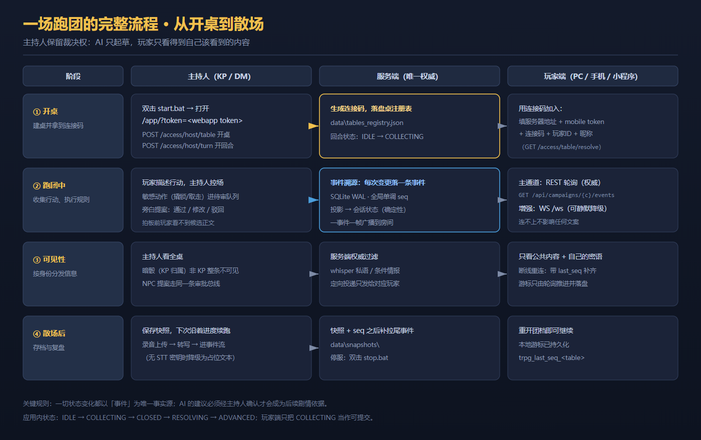
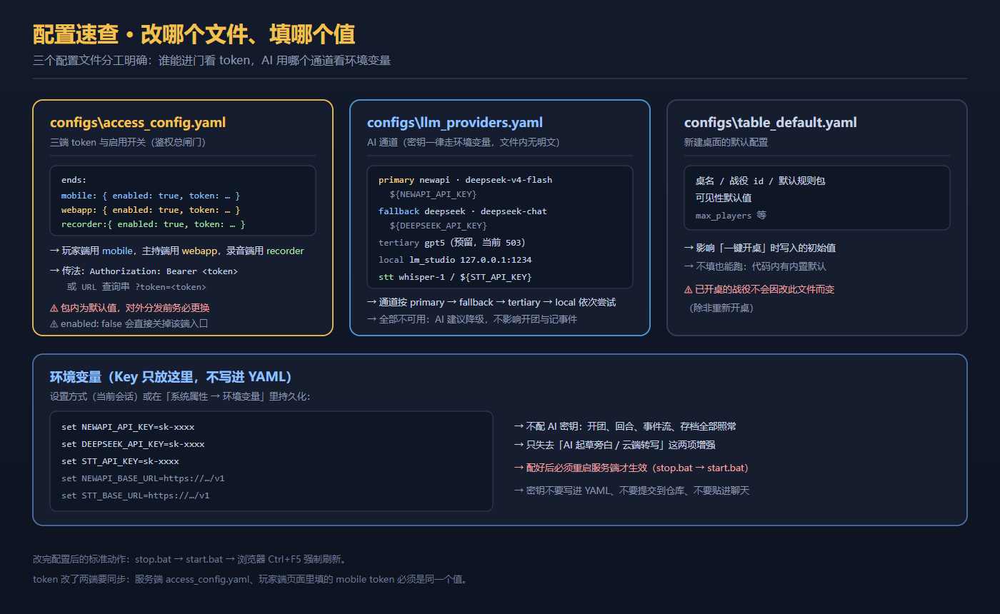
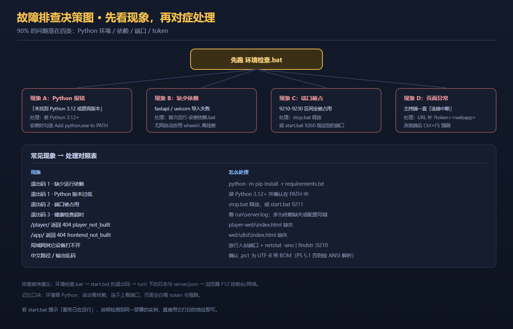

# TRPG 跑团辅助系统 · 服务端

[](LICENSE)
[](https://www.python.org/)
[](https://fastapi.tiangolo.com/)
[](#一环境要求)
[](#三安装依赖)

> **一份包、一个端口**：主持端界面与玩家端页面都由同一个 FastAPI 进程托管。
> 解压 → 双击 `start.bat` → 浏览器开桌，局域网内 PC / 手机 / 微信小程序同时入局。

本文件是**使用手册**：怎么装、怎么起、怎么配、出问题怎么办。
架构与内部调度原理见 [`docs/TRPG-项目架构与调度关系说明.md`](docs/TRPG-项目架构与调度关系说明.md)。

---

## 目录

1. [一、环境要求](#一环境要求)
2. [二、快速开始（三步）](#二快速开始三步)
3. [三、安装依赖](#三安装依赖)
4. [四、启动与停止](#四启动与停止)
5. [五、打开主持端与玩家端](#五打开主持端与玩家端)
6. [六、配置方法](#六配置方法)
7. [七、局域网联机](#七局域网联机)
8. [八、可选增强功能](#八可选增强功能)
9. [九、可能遇到的问题](#九可能遇到的问题)
10. [十、目录结构](#十目录结构)
11. [十一、端点速览](#十一点端速览)

---


---

## 一、环境要求

| 项 | 要求 | 说明 |
|---|---|---|
| 操作系统 | Windows 10 / 11 | 启动脚本基于 `cmd` + PowerShell 5.1，未在 Linux / macOS 上验证 |
| Python | **3.12 或更高** | 实测 3.12.10 / 3.13.1；安装时**务必勾选** `Add python.exe to PATH` |
| 磁盘 | 约 500 MB | 含 `wheels\` 离线依赖与 `web\dist\` 预构建前端 |
| 浏览器 | Chrome / Edge / Firefox | 主持端建议 Chrome |
| 网络 | 首次装依赖需要；跑团本身只需局域网 | 无外网也能跑（见下一节） |

**不需要**：Node.js、npm、数据库服务、Docker。前端是预构建产物，数据库是进程内嵌的 SQLite。

---

## 二、快速开始（三步）

```bat
:: 第 1 步：检查环境（可选但强烈推荐）
::   双击  环境检查.bat
::   它会检查 Python 版本 / 依赖 / 9210-9230 端口 / 关键文件，输出 OK 或 FAIL

:: 第 2 步：启动
::   双击  start.bat
::   窗口会打印本机地址与局域网地址

:: 第 3 步：浏览器打开主持端
::   http://127.0.0.1:<端口>/app/?token=<webapp token>
::   玩家端：http://127.0.0.1:<端口>/player/
```

> ⚠️ **主持端必须带 `?token=`**，否则页面会一直显示「连接中断，正在重连…」。
> token 取 `configs\access_config.yaml` 里 `webapp` 项的值。

---

## 三、安装依赖

### 3.1 常规安装（有网络）

双击 **`首次运行-安装依赖.bat`**，等价于：

```bat
python -m pip install -r requirements.txt
```

### 3.2 离线安装（无网络）

包内 `wheels\` 已内置全部运行依赖（同时含 **cp312 与 cp313** 两套二进制 wheel，覆盖 Python 3.12 / 3.13）。
`首次运行-安装依赖.bat` 在检测到无网络时会**自动切换**到离线模式：

```bat
python -m pip install --no-index --find-links wheels -r requirements.txt
```

### 3.3 依赖清单

| 包 | 用途 | 是否必需 |
|---|---|---|
| `fastapi` / `uvicorn[standard]` | Web 框架与 ASGI 服务器（`[standard]` 含 websockets） | 必需 |
| `pydantic` | 数据校验（事件模型） | 必需 |
| `aiosqlite` | 事件库 SQLite WAL | 必需 |
| `PyYAML` | 读取 `configs\*.yaml` | 必需 |
| `python-multipart` | 录音上传 `multipart/form-data` | 必需 |
| `httpx` | STT / TTS 云端调用 | 必需（无 key 时自动降级） |
| `openai` | LLM 建议与云端转写 | **可选** |

### 3.4 wheel 版本不匹配怎么办

wheel 文件名里的 `cp312` / `cp313` 标签**必须与目标机 Python 版本一致**。
若目标机是别的版本（如 3.11），在有网机器上执行：

```bat
python -m pip download -r requirements.txt -d wheels --only-binary=:all:
```

然后把整个 `wheels\` 目录拷到目标机。

---

## 四、启动与停止

### 4.1 启动

```bat
start.bat          :: 自动挑选端口（从 9210 起探测到 9230，取第一个空闲）
start.bat 9260     :: 指定端口启动（该端口被占用则报错退出，不会静默换端口）
```

启动脚本依次执行：

1. 检测 Python 是否安装且版本 ≥ 3.12；
2. 检查运行依赖是否齐备；
3. 探测端口占用（若本服务已在运行 → 直接打印现有地址并退出，**幂等**）；
4. 后台拉起 uvicorn；
5. 轮询 `/api/health`（最长 30 秒，返回 200 且 `status=ok` 才算成功）；
6. 打印**实际访问地址**（含局域网 IP）。

### 4.2 停止

```bat
stop.bat           :: 读取 run\server.port 定位端口，优雅停止并确认端口释放
stop.bat 9260      :: 停止监听该端口的实例
```

`stop.bat` 只停**本部署**：先做命令行防误杀校验，再用身份端点 `GET /__trpg_server__` 确认「是本部署」；
不是本部署一律拒绝停止。**不会**误杀同机其它 TRPG 部署或无关进程。

### 4.3 退出码

| 码 | 含义 | 处理 |
|---|---|---|
| `0` | 成功（或服务已在运行） | — |
| `1` | 环境 / 依赖错误 | 跑 `环境检查.bat` 定位 |
| `2` | 端口冲突（显式指定端口时） | `stop.bat` 释放，或换端口 |
| `3` | 健康检查超时 | 看 `run\server.log` |

### 4.4 启动后落盘的文件

`run\` 目录（已 gitignore）在启动成功后写入：

| 文件 | 内容 |
|---|---|
| `run\server.port` | 实际端口（纯数字） |
| `run\server.json` | `{port, host, pid, url, deployment_id, install_dir, started_at}` |
| `run\deployment.id` | 本部署的稳定身份（UUID v4，首次启动生成后每次复用） |
| `run\server.log` | 运行日志（排查问题主要看这里） |

> 💡 **配套客户端自动对接**：Web 客户端启动时读取同父目录 `..\trpg-server\run\server.json` 的
> `port` / `url` 自动填地址，无需手工输入。

### 4.5 同机装了多个 TRPG 服务端

`GET /api/health` 只回答「活着」，**不能**区分是哪个部署。为此提供身份端点（无鉴权、不含密钥）：

```bat
curl http://127.0.0.1:9210/__trpg_server__
:: {"service":"trpg-server","ok":true,"pid":2188,"port":9210,
::  "deployment_id":"5c5b15c4-...","install_dir":"C:\\...\\TRPG-服务端"}
```

| 端口上的占用者 | `start.bat <该端口>` | 无参数 `start.bat` |
|---|---|---|
| **本部署** | 幂等：`exit 0`，不重复起第二个实例 | 复用该端口 |
| **别的 TRPG 部署** | **真冲突**：`exit 2` + 打印占用者 PID，不覆写 `run\server.json` | 跳过它，落第一个空闲端口 |
| 其它任意进程 | **真冲突**：`exit 2` | 跳过它 |

---

## 五、打开主持端与玩家端

### 5.1 主持端（KP / DM）

```text
http://127.0.0.1:<端口>/app/?token=<webapp token>
```

- **必须带 `?token=`**（WebSocket 需 token 鉴权，缺了会一直「连接中断，正在重连…」）。
- 「GM 总览」还需 URL 带战役参数：`#/overview?campaign=<战役ID>`。
- 主持端功能：回合管理、待审队列审批、地图与 Token、角色卡、复盘视图、仪表盘。

### 5.2 玩家端

```text
http://127.0.0.1:<端口>/player/            :: 本机
http://<本机IP>:<端口>/player/             :: 局域网其它设备
```

页面里填写 **服务器地址 + mobile token + 连接码 + 玩家 ID + 昵称**，
依次点「测试连接」→「解析连接码」→「加入跑团」。

> 样式表可直接访问验证：`http://127.0.0.1:<端口>/player/app.css`

### 5.3 微信小程序端

微信开发者工具「导入项目」选择小程序目录（`appid=touristappid`，无需真实 AppID），
在「详情 → 本地设置」勾选「不校验合法域名、TLS 版本以及 HTTPS 证书」，即可直连 `http://<IP>:9210`。

---



---

## 六、配置方法



三个配置文件分工明确，改完都要 **`stop.bat` → `start.bat` → 浏览器 `Ctrl+F5`** 才生效。

### 6.1 `configs\access_config.yaml` —— 三端 token（鉴权总闸门）

```yaml
version: 1
ends:
  mobile:                       # 玩家端用的 token
    enabled: true
    token: <32 位十六进制>
  webapp:                       # 主持端用的 token
    enabled: true
    token: <32 位十六进制>
  recorder:                     # 录音端用的 token
    enabled: true
    token: <32 位十六进制>
auto_connect:
  enabled: true
  poll_interval_s: 2
```

**要点：**

- **哪个端用哪个 token**：玩家端（PC / 手机 / 小程序）用 `mobile`；主持端用 `webapp`；录音端用 `recorder`。
  用错端会收到 `401`（无 token / token 不合法）或 `403`（token 合法但属于别的端，如 `kp_only` / `mobile_only`）。
- **两种传法**：请求头 `Authorization: Bearer <token>`，或 URL 查询串 `?token=<token>`。
- **改 token 要两端同步**：服务端改完，玩家端页面里填的 mobile token 必须是同一个值，否则连不上。
- **`enabled: false`** 会直接关闭该端入口（例如只需要玩家端时，可关掉 `recorder`）。
- 🔒 **包内是默认明文值，对外分发前必须更换**（三个都换，并同步更新玩家端的使用说明）。
- 生成新 token 的简单办法：`python -c "import secrets;print(secrets.token_hex(16))"`。

### 6.2 `configs\llm_providers.yaml` —— AI 通道

密钥**一律走环境变量**，本文件内没有任何明文密钥。通道按顺序尝试：`primary` → `fallback` → `tertiary` → `local`。

```yaml
defaults:
  max_tokens: 512
  empty_retry: 1                 # 空输出重试次数
primary:
  name: newapi
  model: deepseek-v4-flash
  base_url: "${NEWAPI_BASE_URL:-https://zzzxin.xin/v1}"
  api_key: "${NEWAPI_API_KEY}"
fallback:
  name: deepseek
  model: deepseek-chat
  base_url: "${DEEPSEEK_BASE_URL:-https://api.deepseek.com/v1}"
  api_key: "${DEEPSEEK_API_KEY}"
tertiary:                        # 预留第三级
  name: gpt5
  base_url: "${GPT5_BASE_URL:-https://api.gavinchen.top/v1}"
  api_key: "${GPT5_API_KEY}"
local:                           # 本地推理（如 LM Studio）
  name: lm_studio
  base_url: "${LMSTUDIO_BASE_URL:-http://127.0.0.1:1234/v1}"
  api_key: "${LMSTUDIO_API_KEY:-lm-studio}"
stt:                             # 语音转写通道
  name: openai-whisper
  model: whisper-1
  base_url: "${STT_BASE_URL:-https://api.openai.com/v1}"
  api_key: "${STT_API_KEY}"
```

### 6.3 环境变量（AI 密钥只放这里）

**改哪个变量：**

| 变量 | 作用 |
|---|---|
| `NEWAPI_API_KEY` | 主通道（newapi）密钥 |
| `DEEPSEEK_API_KEY` | 备用通道（DeepSeek 官方）密钥 |
| `GPT5_API_KEY` | 第三级通道密钥（当前该端点 503，仅预留） |
| `STT_API_KEY` | 语音转写密钥 |
| `NEWAPI_BASE_URL` / `DEEPSEEK_BASE_URL` / `STT_BASE_URL` | 自定义端点（走代理或自建网关时改） |
| `LMSTUDIO_BASE_URL` / `LMSTUDIO_API_KEY` | 本地模型端点 |

**怎么设置（当前会话）：**

```bat
set NEWAPI_API_KEY=sk-xxxx
set DEEPSEEK_API_KEY=sk-xxxx
set STT_API_KEY=sk-xxxx
```

**怎么设置（持久化）：** 「此电脑 → 属性 → 高级系统设置 → 环境变量」里新增，之后**重新打开**命令行窗口。

> ⚠️ 设置完必须**重启服务端**（`stop.bat` → `start.bat`）才生效。
> ⚠️ 密钥不要写进 YAML、不要提交到仓库、不要贴进聊天记录。

### 6.4 `configs\table_default.yaml` —— 新建桌面的默认值

影响「一键开桌」时写入的初始值（桌名、战役 id、默认规则包、可见性默认值等）。
不填也能跑（代码内有内置默认）。**已开桌的战役不会因改此文件而改变**，除非重新开桌。

### 6.5 `web\.env.production` —— 前端构建期开关

包内确实含 1 个 `.env` 文件：`web\.env.production`（451 B），内容仅 `VITE_TRPG_TRANSPORT=real` 与注释，
**不含任何 token / 密钥**。它是 GM 端前端**构建期**的模式开关。
运行期真正的连接参数（table / viewer / role / campaign / token / ws）一律由 URL 查询串给出，不落在这个文件里。

---

## 七、局域网联机

服务默认监听 `0.0.0.0`。首次使用需放行入站端口（**管理员** PowerShell）：

```powershell
netsh advfirewall firewall add rule name="trpg-9210" dir=in action=allow protocol=TCP localport=9210 remoteip=192.168.0.0/16
```

> 建议用 `remoteip` **限定来源网段**，不要对任意来源开放。

之后其它设备访问 `http://<本机IP>:<端口>/player/` 即可（本机 IP 用 `ipconfig` 查看）。

### 公网访问（安全警告）

可用 `cloudflared` 快速隧道临时暴露：

```powershell
cloudflared tunnel --url http://127.0.0.1:9210
```

> ⚠️ **quick tunnel 无鉴权**，且部分 `/api/*` 路径不带 token 校验。
> 公网暴露期间等同于把内网 API 开放给匿名访问者。
> 生产环境必须改用**命名隧道 + Cloudflare Access** 或 **Nginx/Caddy + Basic Auth + 路径白名单**，
> 并限制可暴露路径。详见 [`docs/DEPLOY.md`](docs/DEPLOY.md)。

---

## 八、可选增强功能

以下功能**不配置也能正常跑团**，只是少了增强项：

| 功能 | 入口 | 不配置时的表现 |
|---|---|---|
| **AI 起草旁白** | 主持端「开始回合」后系统推提案 | 无提案，主持人手写旁白 |
| **云端语音转写** | 玩家端录音上传 → 服务端后台 STT | 落一条 `[STT 降级]` 占位文本，**不阻断**上传流程 |
| **TTS 播报** | 旁白通过后播报 | 静默标记 → 文本降级三级链 |
| **NPC 自主叙事** | 主持端 NPC 面板 | 默认解锁；`TRPG_NPC_GATE=locked` 可锁回旧 403 语义 |
| **DSH 助手面板** | 双击 `dsh\start.bat` → `/app/#/dsh` | 见下方说明 |

### DSH 助手面板

双击 `dsh\start.bat`：自动确保服务端在跑，并打开 `http://127.0.0.1:<端口>/app/?token=<webapp>#/dsh`。

**已知限制（如实说明）：**

1. 它是 DSH 的**前端外壳**，本身不含 DSH 引擎后端。页面能正常加载、不再报插件错误，
   但**不会真正「连上」一个 DSH 会话**（会停在「重新连接中 / 选择工作区」）。要真正对话需另外提供 DSH 引擎 host。
2. **token 是另一个参数**：URL 上的 `?token=` 只管主界面的 WebSocket；
   DSH 面板自己从 `localStorage` 读 `trpg_token`。若面板提示「未配置接入 token」，按 F12 在控制台执行：
   ```js
   localStorage.setItem('trpg_token', '<webapp token>')
   ```
   设置后无需重启。

### 模组包（.modpkg）

`modpacks\` 存放**预构建样例产物**，不是运行时依赖。
服务端的下载端点 `GET /api/modules/{id}/download` 会从 `modules\{id}\` **现场打包**，
不从 `modpacks\` 读取。参考 `modpacks\README.txt`。

> ℹ️ **两个 sha256 不是同一个量**：`GET /api/modules` 条目里的 `sha256/size/files` 是
> **解包后目录摘要**；下载物 `.modpkg` 的字节 sha256 由 `GET /api/modules/{id}/package` 的
> `artifact.sha256` 与下载响应头 `X-Artifact-Sha256` 给出。**校验下载物请用后者**。
> 详见 [`docs/R35-DEFECT-CLOSURE.md`](docs/R35-DEFECT-CLOSURE.md)。

---



---

## 九、可能遇到的问题

### 9.1 启动阶段

| 现象 | 原因 | 处理 |
|---|---|---|
| 退出码 1「缺少运行依赖」 | 依赖未装 | 双击 `首次运行-安装依赖.bat`，或 `python -m pip install -r requirements.txt` |
| 退出码 1「Python 版本过低」 | 版本 < 3.12 或 `python` 不在 PATH | 装 Python 3.12+，安装时勾选 `Add python.exe to PATH` |
| 退出码 1「未找到 Python」 | PATH 未生效 | 重开命令行窗口；或卸载重装并勾选 PATH |
| 退出码 2「端口被占用」 | 指定端口被别的进程占用 | `stop.bat` 释放；或换端口 `start.bat 9211` |
| 退出码 3「健康检查超时」 | 启动失败（依赖缺失 / 配置写错 / 端口被拦） | 看 `run\server.log`；多数是依赖或 YAML 语法错误 |
| 「服务已在运行」 | 检测到本部署的实例（正常幂等行为） | 直接用窗口打印的地址，无需重启 |
| 双击 `start.bat` 窗口一闪而过 | 脚本报错后退出 | 打开 `cmd` 进入该目录手动执行 `start.bat`，看完整输出 |

### 9.2 页面与连接

| 现象 | 原因 | 处理 |
|---|---|---|
| 主持端一直「连接中断，正在重连…」 | URL **缺 `?token=`**，或 token 不是 `webapp` 项 | 补上 `?token=<webapp token>` |
| 「测试连接」返回 **401** | token 不正确或为空 | 核对 `configs\access_config.yaml` 里的 token |
| 「测试连接」返回 **403** | token 合法但**属于别的端** | 玩家端必须用 `mobile` token |
| `/player/` 返回 404 `player_not_built` | `player-web\index.html` 缺失 | 重新解压完整包 |
| `/app/` 返回 404 `frontend_not_built` | `web\dist\index.html` 缺失 | 重新解压完整包 |
| 改了前端但浏览器还是旧界面 | 浏览器缓存 | **`Ctrl+F5` 强制刷新** |
| 「解析连接码」失败 | 连接码拼写错误，或主持端尚未开桌 | 主持端先开桌，再核对连接码 |
| 录音功能不可用 | 浏览器要求安全上下文 | 录音需 `https://` 或 `http://localhost` / `http://127.0.0.1`；明文 HTTP 的局域网地址下浏览器禁用麦克风，**其余功能不受影响** |
| 事件流长时间不刷新 | 服务端未运行 / 网络中断 | F10 状态行会显示「重连中…／已断开」；检查服务端 |
| 页面样式错乱 | `player-web\` 下文件不齐 | 确认 `app.css` / `app.js` / `strings.json` / `tokens.json` 都在 |

### 9.3 局域网与防火墙

| 现象 | 原因 | 处理 |
|---|---|---|
| 其它设备打不开页面 | 防火墙未放行入站端口 | 按第七节放行（管理员权限），并用 `remoteip` 限网段 |
| 本机能开、手机不能 | 用了 `127.0.0.1` 而非本机局域网 IP | 改用 `http://<本机IP>:<端口>/player/` |
| 端口确认 | — | `netstat -ano | findstr :9210` |

### 9.4 配置与数据

| 现象 | 原因 | 处理 |
|---|---|---|
| 改了 token 但没生效 | 未重启服务端 | `stop.bat` → `start.bat`；玩家端同步改页面里填的值 |
| 改了 AI 密钥但 AI 仍不工作 | 环境变量未在当前进程生效 | 设置后**必须重启服务端** |
| AI 无响应 / 报错 | 通道不可用 | 系统按 `primary → fallback → tertiary → local` 自动降级；全部不可用时 AI 建议降级，**不影响开团与记事件** |
| 转写结果只有 `[STT 降级]` | 未配 STT 密钥或后端失败 | 属预期降级行为，不阻断上传流程；配好 `STT_API_KEY` 后重启 |
| 重启后幂等键失效 | 幂等表为**进程内存态** | 契约承认的行为（重启即清），验收/演示自建桌即可 |
| 中文路径 / 中文输出乱码 | `.ps1` 丢了 UTF-8 BOM，PowerShell 5.1 按 ANSI 解析 | 确认 `.ps1` 保存为 **UTF-8 带 BOM** |

### 9.5 安全相关（分发前必读）

| 项 | 说明 | 建议 |
|---|---|---|
| **三端明文 token** | 包内为默认固定值，随包分发 | **公开分发前必须更换**，玩家端同步更新 |
| `/api/*` 部分端点无鉴权 | 如 `/api/tables`、事件流（契约登记项） | 公网暴露必须经反代 + 路径白名单 + 认证收口 |
| `/docs`、`/openapi.json` 匿名可达 | 局域网内匿名 200 | 生产部署用反代收口 |
| 公网快速隧道无鉴权 | `cloudflared` quick tunnel | 改用命名隧道 + Access 或反代 Basic Auth |

### 9.6 排查顺序建议

1. **`环境检查.bat`** —— 先确认 Python / 依赖 / 端口三项；
2. **`start.bat` 的退出码** —— 0/1/2/3 直接指向问题类别；
3. **`run\server.log`** —— 启动失败的真正原因都在这里；
4. **`run\server.json`** —— 确认实际端口与 PID；
5. **浏览器 F12** —— 控制台报错 + 网络面板看请求状态码（401/403 一眼定位 token 问题）。

> 记忆口诀：**环境看 Python、启动看依赖、连不上看端口、页面空白看 token 与强刷。**

---

## 十、目录结构

```text
TRPG-服务端/
├─ start.bat / stop.bat            启动 / 停止（纯 ASCII 包装器，双击即用）
├─ 环境检查.bat                     环境检查：Python / 依赖 / 端口 / 关键文件
├─ 首次运行-安装依赖.bat             安装依赖（有网 pip，无网自动用 wheels\ 离线）
├─ 自检.bat                        解压后自检，输出 PASS / FAIL
├─ 准备内置浏览器.bat                可选：把本机 Chrome 复制进包（约 430 MB）
├─ 使用说明.txt / 项目说明.txt        随包说明
├─ scripts/                        start.ps1 / stop.ps1 / _serve.py（真实启动逻辑）
├─ app/                            服务端应用
│  ├─ main.py                      FastAPI 入口
│  ├─ web/                         路由层：access / rest / ws / ws_bridge / static
│  ├─ app_core/                    命令总线（唯一写口 + 幂等）
│  ├─ domain/                      领域模型与事件定义（冻结契约）
│  ├─ store/                       事件溯源存储（SQLite WAL）/ 投影 / 快照
│  ├─ scheduler/                   回合调度与分支守卫
│  ├─ agent/                       LLM 网关 / 提案槽 / 审稿链
│  ├─ voice/                       语音链路（STT / TTS，无 key 自动降级）
│  ├─ mcp/                         MCP 工具面
│  ├─ rules/                       规则判定与骰点
│  └─ npc/                         NPC 技能 / 记忆 / 自主行动
├─ trpg/                           领域内核（裁判、规则内核、协调器）
├─ configs/                        配置文件 ← 见第六节
│  ├─ access_config.yaml           三端 token 与启用开关
│  ├─ llm_providers.yaml           AI / STT 通道
│  └─ table_default.yaml           新建桌面默认值
├─ web/dist/                       主持端（KP）界面，预构建，无需 npm
├─ web/src/                        主持端源码（回构建用）
├─ player-web/                     玩家端页面（零构建，6 个文件）
├─ modules/ rulepacks/ skills/     业务模块 / 规则包 / 技能
├─ modpacks/                       预构建模组包样例（非运行时依赖）
├─ dsh/                            DSH 助手面板启动脚本
├─ wheels/                         离线依赖 wheel（cp312 + cp313）
├─ data/                           运行期数据：trpg.db / tables_registry.json
├─ run/                            运行期生成：server.json / server.port / server.log
├─ docs/                           交付文档（部署 / 运维 / 契约 / 规则包等）
├─ requirements.txt                运行依赖
└─ pyproject.toml / Makefile       项目元数据与常用任务
```

---

## 十一、端点速览

统一响应包裹：成功 `{ok:true,data:{...},code:0}`；失败 `{ok:false,error:"...",code:<http>}`。
> 例外：`/api/health` 与 `/__trpg_server__` 返回**裸 JSON**（不套包裹）。

| 用途 | 端点 | 鉴权 |
|---|---|---|
| 健康检查 | `GET /api/health` | 无 |
| 部署身份 | `GET /__trpg_server__` | 无 |
| 主持端 UI | `GET /app/` | 无 |
| 玩家端页面 | `GET /player/` | 无 |
| 服务信息 | `GET /access/info` | 任一启用端 token |
| 连接码解析 | `GET /access/table/resolve?code=` | 任一启用端 token |
| 会话状态 | `GET /access/mobile/state?table_id=` | mobile |
| 提交行动 | `POST /access/mobile/action` | mobile |
| 玩家录音上传 | `POST /access/player/audio` | mobile |
| 设备状态 | `GET /access/device/status?device_id=` | 任一启用端 token |
| 一键开桌 | `POST /access/host/table` | webapp (KP) |
| 开启行动窗 | `POST /access/host/turn` | webapp (KP) |
| AI 建议 / 自然语言调度 | `POST /access/advice`、`/access/nl` | webapp (KP) |
| 音频导入 / 音色注册 / 转写 | `POST /access/audio_upload`、`/access/voice/*` | recorder |
| 事件流 | `GET /api/campaigns/{c}/events?since=&limit=&token=` | 当前不校验（契约登记项） |
| 实时通道 | `WS /ws?table=&viewer=&role=pl&token=` | 任一启用端 token |
| 场景交互物 | `GET /api/campaigns/{c}/interactives` | mobile |
| 提交交互 | `POST /api/campaigns/{c}/interact` | mobile |
| 待审队列 / 审批 | `GET\|POST /api/campaigns/{c}/approvals` | webapp (KP) |
| NPC 自主性 | `GET /api/campaigns/{c}/npc/state`、`/npc/proposals` | webapp (KP) |
| 规则包 | `/api/rules/*` | webapp (KP) |
| 模组库 | `GET /api/modules`、`GET /api/modules/{id}` | 无 |
| 模组下载 | `GET /api/modules/{id}/download`、`/package` | 无 |
| MCP 工具面 | `GET /mcp`、`POST /mcp/tools/list`、`/mcp/tools/call` | list 需 token；call 走工具级矩阵 |

> ⚠️ 实时通道地址**恒为 `/ws`**。`/access/ws` 只是返回参数说明的 GET 端点，**不要**当作 WebSocket URL。

---

## 十二、文档

| 文档 | 内容 |
|---|---|
| [`docs/DEPLOY.md`](docs/DEPLOY.md) | 部署手册（含反代 / 加固方案） |
| [`docs/OPERATIONS.md`](docs/OPERATIONS.md) | 日常运维 |
| [`docs/PLAYER-WEB.md`](docs/PLAYER-WEB.md) | 玩家端页面说明 |
| [`docs/MINIPROGRAM.md`](docs/MINIPROGRAM.md) | 小程序端说明 |
| [`docs/CROSS-END-CONTRACT.md`](docs/CROSS-END-CONTRACT.md) | 跨端契约（冻结） |
| [`docs/ENDPOINT-SPEC-NEW.md`](docs/ENDPOINT-SPEC-NEW.md) | 端点规格 |
| [`docs/RULEPACKS.md`](docs/RULEPACKS.md) | 规则包格式与用例 |
| [`docs/BUILD-WEB.md`](docs/BUILD-WEB.md) | GM 前端构建说明 |
| [`docs/UI-TOKENS-MODU.md`](docs/UI-TOKENS-MODU.md) | GM 端主题覆盖层说明 |
| [`docs/ROADMAP-DEFERRED.md`](docs/ROADMAP-DEFERRED.md) | 延后项路线图 |

---

## 许可

本项目基于 [MIT License](LICENSE) 发布。
